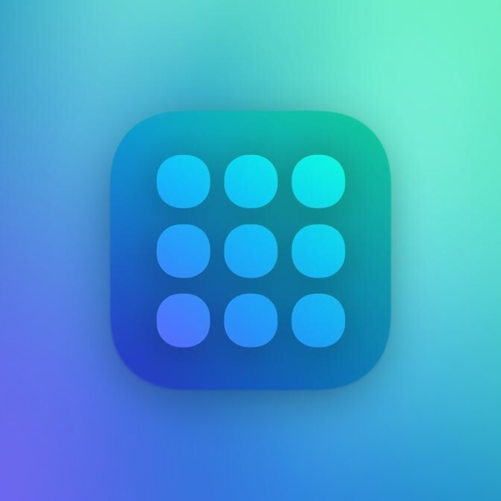
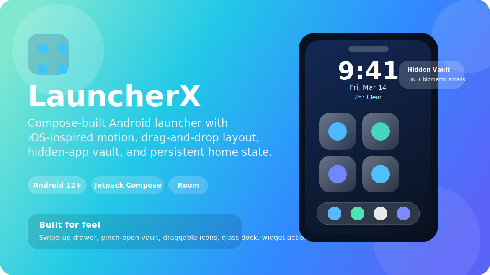
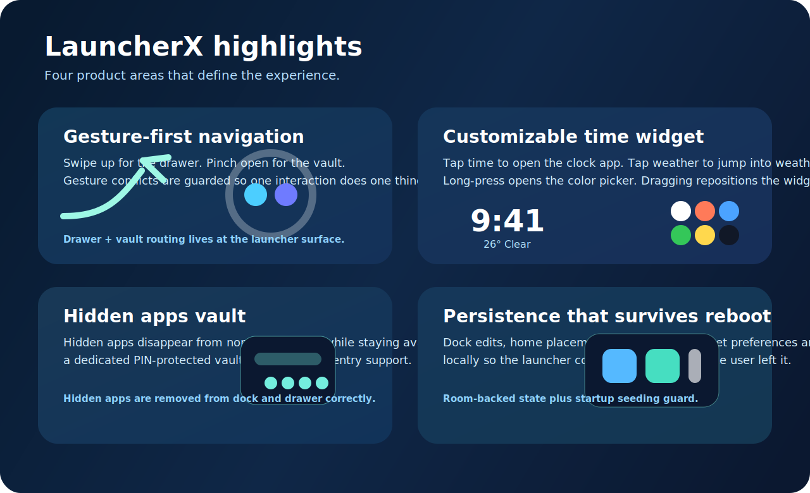
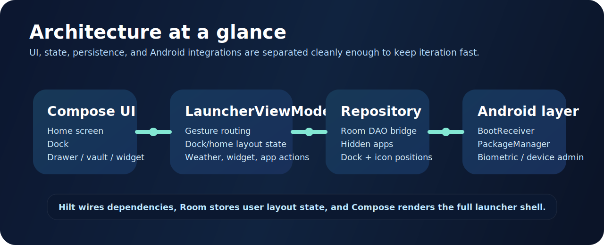

<p align="center">
  
</p>

<h1 align="center">LauncherX</h1>

<p align="center">
  
</p>

<p align="center">
  
  
  
  
  
  
</p>

<h1 align="center">LauncherX</h1>

<p align="center">
  A polished Android launcher with an iOS-inspired visual language, gesture-first navigation,
  draggable home layout, hidden-app vault, live weather-enabled time widget, and persistent dock/home state.
</p>

<p align="center">
  Built entirely in Kotlin with Jetpack Compose.
</p>

## Visual Tour

<p align="center">
  
</p>

<p align="center">
  
</p>

## What LauncherX Focuses On

LauncherX is not trying to be a generic launcher skin. The project is built around three things:

- Fast, direct interactions: swipe up for the app drawer, pinch open for the vault, drag apps between the dock and the home grid, and tap straight into clock and weather actions.
- A cleaner home surface: a single-page home layout, large time widget, glass-style dock, and minimal visual noise.
- Real persistence: user-edited dock and home placements are stored locally and kept across app relaunches and device restarts.

## Feature Set

| Area | What is implemented |
| --- | --- |
| Home screen | Single-page grid, custom dock, drag and drop, app info/remove/uninstall actions |
| Gestures | Swipe up to open drawer, pinch gesture to open the hidden-app vault, guarded gesture arbitration |
| Widget layer | Draggable time widget, long-press color picker, clock app launch, weather app shortcut, live weather text |
| App drawer | Search, add-to-home action, hidden-app filtering, launcher settings shortcut |
| Hidden apps vault | PIN-protected access, biometric prompt, hidden/unhidden app management |
| Persistence | Room-backed icon/dock layout, hidden app state, widget preferences, reboot-safe layout restoration |
| System integration | Default launcher onboarding, boot receiver, notification listener, uninstall/default launcher shortcuts |

## Why The UI Feels Different

- Edge-to-edge Compose UI instead of a standard XML launcher shell.
- A stronger visual hierarchy centered around the time widget and dock.
- Intentional motion paths for app launch, dragging, overlays, and vault transitions.
- Minimal chrome: the home screen stays empty until the user decides what belongs there.

## Tech Stack

| Layer | Tools |
| --- | --- |
| UI | Kotlin, Jetpack Compose, Material 3 |
| State | `LauncherViewModel`, Kotlin Flow, Compose state |
| Dependency injection | Hilt |
| Local data | Room |
| Security | EncryptedSharedPreferences, BiometricPrompt, Device Admin receiver support |
| App metadata and icons | `PackageManager`, custom icon handling |
| Build | Gradle Kotlin DSL, KSP, release signing hook via `keystore.properties` |

## Project Layout

```text
app/src/main/kotlin/com/launcherx
|- LauncherActivity.kt         # Main launcher surface and gesture routing
|- LauncherViewModel.kt        # App state, layout persistence, weather, drag/drop
|- home/                       # Home grid, icon cells, page logic
|- dock/                       # Glass dock UI
|- drawer/                     # App drawer UI
|- vault/                      # Hidden-app vault and PIN flow
|- widgets/                    # Time widget and widget system
|- lockscreen/                 # Lock screen services and admin receiver
|- data/                       # Room DAOs, entities, repository, database
|- settings/                   # Launcher settings panel
|- onboarding/                 # Default launcher setup flow
`- ui/theme/                   # Typography, colors, visual system
```

## Getting Started

### Requirements

- Android Studio Hedgehog or newer
- JDK 17
- Android SDK 34
- A device or emulator running Android 12 or newer

### Build a debug APK

```bash
./gradlew assembleDebug
```

### Build a release APK

```bash
./gradlew assembleRelease
```

If a local `keystore.properties` file is present, the release APK will be signed automatically.

## Release Signing

The repository is configured to load release signing data only when a local `keystore.properties` file exists.
That file is intentionally ignored by Git, so private signing material never needs to be committed.

Start from the included template:

```bash
cp keystore.properties.example keystore.properties
```

Then update it with your own values:

```properties
storeFile=keystore/your-release-key.jks
storePassword=change-me
keyAlias=launcherx_release
keyPassword=change-me
```

After that:

```bash
./gradlew assembleRelease
```

## Current Highlights In This Repo

- Hidden apps are removed from both the app drawer and dock correctly.
- Home and dock placements persist across relaunch and reboot.
- Gesture conflicts between vault pinch and drawer swipe are guarded.
- The time widget supports both tap actions and long-press color customization.
- The project is ready for signed local release builds without checking secrets into Git.

## Notes

- This launcher uses `QUERY_ALL_PACKAGES` because a launcher must enumerate installed apps to function correctly.
- Weather information is fetched at runtime when weather is enabled from the home widget interaction.
- The repo excludes generated build output, APKs, and private keystore material by default.

## Build Commands

```bash
./gradlew assembleDebug
./gradlew assembleRelease
./gradlew installDebug
```

## Repository Assets

- [Hero banner](docs/assets/hero.svg)
- [Feature highlights graphic](docs/assets/highlights.svg)
- [Architecture overview graphic](docs/assets/stack.svg)

---

<p align="center">
  LauncherX is a focused personal launcher project built for feel, speed, and control.
</p>
